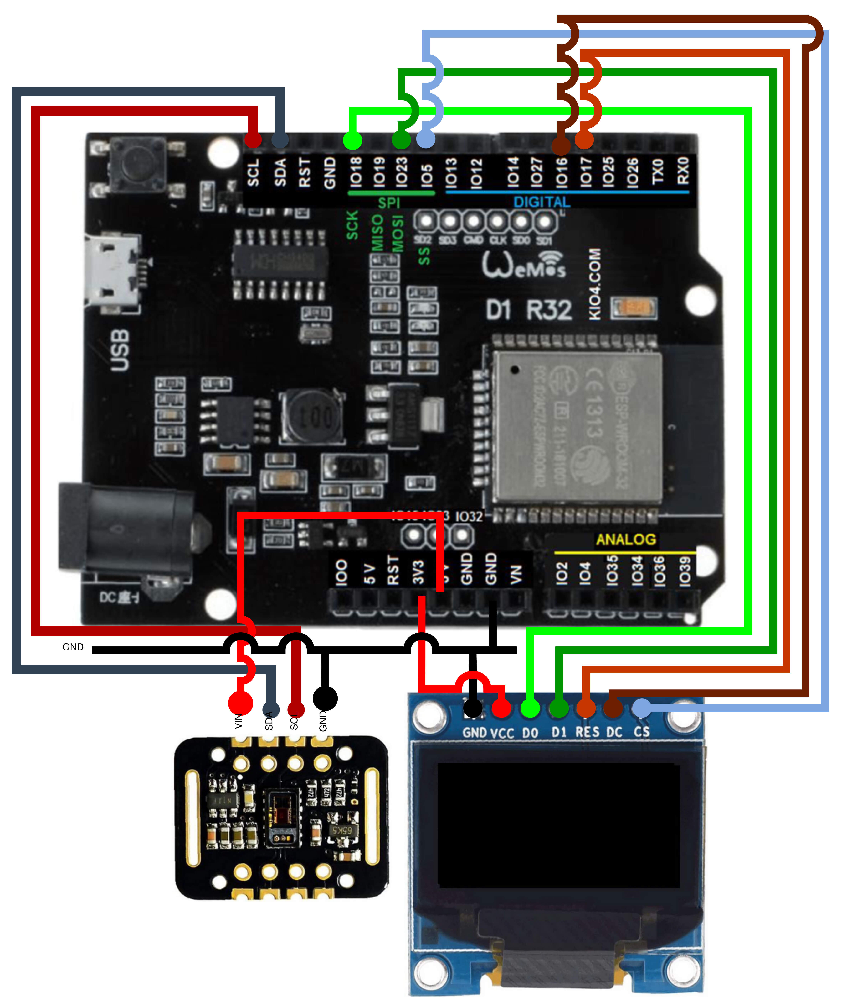

# Introduction
The aim of this project is to design and implement a heart rate and oxygen saturation monitor. The heart rate frequency (measured in beats per minute) as well as oxygen saturation needs to be shown on a display.

Used components were:
- `MAX30102` sensor for heart rate and oxygen saturation (source: [MAX30102 Manual](https://www.analog.com/media/en/technical-documentation/data-sheets/max30102.pdf))
- `SSD1306` OLED display (source: [SSD1306 Manual](https://cdn-shop.adafruit.com/datasheets/SSD1306.pdf))
- `ESP32` microcontroller (source: [ESP32 Manual](https://www.espressif.com/sites/default/files/documentation/esp32_technical_reference_manual_en.pdf))

From a software's point of view, the heart is "Espressif IoT Development Framework" (ESP-IDF) (source: [ESP-IDF Documentation](espidf:docs)).

# Circuit diagram, components
To facilitate manipulation, every component is placed on a breadboard, but for illustration purposes, the components are connected directly.

## MAX30102 - pulse oximeter
Module uses I2C protocol for communication with outside components.

Input voltage pin of the oximeter is connected to the 5V pin on the WeMoS board. For grounding, a common ground for both display and oximeter is used. Since this sensor uses I2C for communication, pins SDA and SCL are connected to the same pins on the microcontroller - SDA and SCL.

## SSD1306 OLED display
The display supports both I2C and SPI. But since I2C is already used for the MAX30102 pulse oximeter, SPI needs to be used instead.

The display requires 3.3V as the input voltage. A common ground for both oximeter and display is used. Pin D0 is connected to I018 pin on the microcontroller, and pin D1 is connected to pin I023. Data/command (DC) pin is connected to pin I016 on the microcontroller side, and chip select (CS) pin is connected to I05. Reset pin RST is connected to I017.

# Implementation
The project was inspired by [Hacker.io](https://hackaday.io/project/164155-esp-heart-rate-monitor#j-discussions-title), and the implementation of I2C communication with the pulse oximeter is taken from there, as well as the algorithm for conversion to beats per minute. Some parts of this "library" were refactored.

Communication over SPI with text rendering is not implemented from scratch; a standard but adjusted ESP-IDF library is used, available on [GitHub](https://github.com/nopnop2002/esp-idf-ssd1306). Some unnecessary parts were removed.

The rest of the implementation is done in main/main.c file.

After machine boot, the app_main function is executed. It initializes both the display and the pulse oximeter. Afterwards, two tasks are created in parallel: max30102_task and draw_data_task.

The draw_data_task, based on the global variable finger_on_sensor, prints the message "Put your finger on the sensor". If the finger is placed on the sensor, the actual heart rate and oxygen saturation are printed on the display. These two values are updated by the max30102_task task, and the minimum allowed time between updates is 0.5 seconds.

## Flashing
The program needs to be compiled and flashed to the microcontroller. Just use the `idf` and `idf.py flash monitor` command that builds everything (if necessary) and flashes it into the ESP32.

# Video demonstration
A video demonstration of the project can be found on [YouTube](https://www.youtube.com/watch?v=KGk2CRs4Ns8).

# Conclusion
The project implements all the parts of the assignment, including the displaying of oxygen saturation. The results are not "professionally" validated; I just compared them with my Apple Watch, and the results were close to each other.

